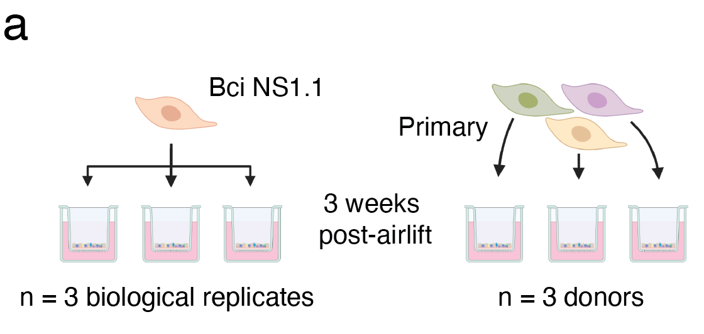

# A comparative study of in vitro air-liquid interface culture models of the human airway epithelium evaluating cellular heterogeneity and gene expression at single cell resolution

*Rachel A. Prescott\*, Alec Pankow\*, Maren de Vries\*, Keaton Crosse, Roosheel S. Patel, Mark Alu, Cindy Loomis, Victor J. Torres, Sergei Koralov, Ellie Ivanova, Meike Dittmann\+, and Brad R. Rosenberg\+*

\*Equal contribution 

\+ Co-corresponding author

### Description 

R analysis code for our comparative study of BCi-NS1.1 and primary human airway epithelial (HAE) cultures at single-cell resolution. 
We perform an in-depth comparison of three biological replicates of HAE cultures derived from BCi-NS1.1 cells (independent differentiations) 
and three replicates of HAE cultures derived from independent, commercially-available donors.

This repository contains the data and code for our paper:

> Rachel A. Prescott, Alec P. Pankow, Maren de Vries... Meike Dittmann, Brad R. Rosenberg (2023). _A comparative study of in vitro air-liquid interface culture models of the human airway epithelium evaluating cellular heterogeneity and gene expression at single cell resolution_. Zenodo [pending] <https://doi.org/xxx/xxx>

Our pre-print is online here:

> Rachel A. Prescott, Alec P. Pankow, Maren de Vries... Meike Dittmann, Brad R. Rosenberg , (2023). _A comparative study of in vitro air-liquid interface culture models of the human airway epithelium evaluating cellular heterogeneity and gene expression at single cell resolution_. BioRxiv, Accessed 2023-02-28. Online at <https://doi.org/10.1101/2023.02.27.530299>

## Contents

The **analysis** directory contains:

  - [:file\_folder: paper](/analysis/paper): R Markdown source documents
    for manuscript. Includes code to reproduce the figures and tables
    generated by the analysis.
  - [:file\_folder: data](/analysis/data): Data files generated by the analysis.
  - [:file\_folder: figures](/analysis/figures): Plots and other
    illustrations generated by the analysis.
  - [:file\_folder: supporting_data](/analysis/supporting_data):
    Location for additional data files required by the analysis. HAE cell reference datasets will be populated here automatically via GEO the first time the analysis is run.
  - [:file\_folder: R](/R):
    R function definitions unique to the analysis.

## How to run in your browser or download and run locally

This research compendium has been developed using the statistical programming
language R. To work with the compendium, you will need
installed on your computer the [R software](https://cloud.r-project.org/)
itself and optionally [RStudio Desktop](https://rstudio.com/products/rstudio/download/).

Clone this repository from GitHub, then:
- Navigate to the project and start R/RStudio.
- Ensure `renv` >= 0.15.5 is installed, and run `renv::restore()` to set up project dependencies. 
- Finally, open `analysis/paper/00_qc_demux_integrate.Rmd` and knit to run analysis code. Proceed through numbered notebooks 00-02 to progress through analysis.

The organization of this repository was adapted from the rrtools
research compendium structure

> Marwick, B. (2017). Computational reproducibility in archaeological
> research: Basic principles and a case study of their
> implementation.*Journal of Archaeological Method and Theory*, 24(2),
> 424-450.<https://doi.org/10.1007/s10816-015-9272-9>

### Licenses

**Figure 1a (above):** Created using [BioRender.com](https://www.biorender.com/). Subject to 
the [Basic Biorender license](https://biorender.com/basic-license/) terms. 

**Text and all other figures:**  [CC-BY-4.0](http://creativecommons.org/licenses/by/4.0/) Brad R Rosenberg, Alec P Pankow

**Gene sets:**

- MSigDB gene sets are protected by copyright (c) 2004-2022 Broad Institute, Inc., Massachusetts Institute of Technology, and Regents of the University of California and subject to [CC-BY-4.0](http://creativecommons.org/licenses/by/4.0/) terms.

- MSigDB gene sets derived from KEGG pathways are protected by copyright, (c) 1995-2017 Kanehisa Laboratories, all rights reserved. For more information, see the [MSigDB license terms](http://www.gsea-msigdb.org/gsea/msigdb_license_terms.jsp).

- MSigDB gene sets derived from BioCarta pathways are protected by copyright, (c) 2000-2017 BioCarta, all rights reserved. For more information, see the [MSigDB license terms](http://www.gsea-msigdb.org/gsea/msigdb_license_terms.jsp).
